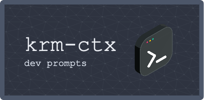

<div align="center">
  
  
🧠 **AI-Assisted Development Framework** 🚀

[](https://github.com/karimstekelenburg/krm-ctx)
[](https://github.com/rooveterinaryinc/roo-cline)

*Transform your development workflow with structured AI collaboration*

-------------------

</div>

A framework of prompt templates for structured, AI-assisted software architecture and development workflows. This repository provides a systematic approach to documenting and managing project context through different phases of development, optimized for AI collaboration.

> **Note**: This framework is in early development and currently tested only with Roo Cline + Claude Sonnet.

## 🎯 Overview

The KRM Context framework transforms the traditional software development process into a structured, AI-assisted workflow. It acts as a bridge between human developers and AI assistants, providing a standardized way to capture, evolve, and maintain project context through all development phases.

### 💡 The Big Idea

Traditional software development often suffers from context loss - requirements get forgotten, design decisions become unclear, and implementation details fade over time. KRM Context solves this by:

1. **Structured Knowledge Capture**: Every piece of project information is documented in a standardized format that both humans and AI can easily understand and work with.

2. **Guided AI Collaboration**: Instead of ad-hoc AI interactions, the framework provides specific protocols for each development phase, ensuring consistent and productive AI assistance.

3. **Living Documentation**: As your project evolves, the framework maintains a clear trail of decisions, requirements, and implementation details, making it easier to onboard new team members or revisit past choices.

### 🌟 Example Story: Building a Weather App

Let's follow how a typical project flows through the KRM Context framework:

1. **Brainstorming Phase**
   - Developer initiates by sharing initial concept with AI: "I want to build a weather app"
   - AI follows `brainstorm.protocol.md` to systematically explore requirements:
     - Captures user stories in `functional-requirements.md`
     - Documents technical constraints in `technical-requirements.md`
     - Records business context in `project-context.md`

2. **Design Phase**
   - AI transitions to `design.protocol.md`
   - Reviews captured requirements to propose architecture:
     - Creates system design in `architectural-design.md`
     - Plans implementation steps in `implementation-plan.md`
     - Breaks down work into sprints and tasks

3. **Implementation Phase**
   - AI follows `implementation.protocol.md`
   - Uses `progress-log.md` to track development
   - Creates PRs with detailed testing instructions
   - Maintains documentation as features are completed

Throughout this process, the framework ensures:
- No requirements are forgotten
- Design decisions are documented
- Implementation follows the plan
- Progress is tracked systematically
- Knowledge is preserved and accessible

## ⚡️ Quick Start

1. First, install Roo Cline from [github.com/rooveterinaryinc/roo-cline](https://github.com/rooveterinaryinc/roo-cline)

2. Install the KRM Context templates:
```bash
curl -o- https://raw.githubusercontent.com/karimstekelenburg/krm-ctx/main/install.sh | bash
```

## 🎁 Features

### 1. 📋 Structured Development Phases

#### Brainstorming Phase
- Systematic requirements gathering through AI-assisted dialogue
- Business context documentation with standardized templates
- Functional and technical requirements definition
- Automated validation of requirement completeness
- SWOT analysis for features and integration points

#### Design Phase
- AI-guided architectural decisions and system design
- Component-level technical specifications
- Infrastructure and security architecture planning
- Detailed implementation planning with epics and sprints
- Technical diagram creation guidance

#### Implementation Phase
- Strict execution protocol for consistent development
- Automated progress tracking and documentation
- Credit usage monitoring for AI interactions
- Standardized PR creation with comprehensive testing instructions

### 2. 📝 Smart Templates

- **Project Context Template**: Captures business goals, constraints, and strategic context
- **Requirements Templates**: Structured documentation of functional and technical requirements
- **Architecture Templates**: Detailed system design and component specifications
- **Implementation Templates**: Task breakdown, sprint planning, and progress tracking

### 3. 🤖 AI-Optimized Workflows

- Standardized protocols for AI-human collaboration
- Structured dialogue patterns for requirement gathering
- Automated validation of phase completions
- Clear handoff procedures between development phases

### 4. 🛠 Development Support

- Automated repository setup and file management
- Progress tracking and credit usage monitoring
- Standardized issue and PR creation
- Comprehensive testing and documentation guidelines

## 🚀 Usage with Cline

1. After installation, the templates will be available in your `.krm-ctx` directory.

2. To start an AI-assisted development session:
   - Open the relevant markdown file (e.g., `entrypoint.md` to begin)
   - Present it to Cline using the command: `<task>Here's my project context: [paste file content]</task>`
   - Follow the phase-specific protocols in the `prompts/` directory
   - Use the corresponding templates to document and evolve your project context through AI collaboration

3. The `.clinerules` file contains specialized instructions that help Cline understand and work effectively with your project context. This file is automatically loaded when you start a conversation in the project directory.

## 📦 Development Phases

### 1. 🧩 Brainstorming
- Define project scope and requirements
- Document business context and constraints
- Specify functional and technical requirements
- Validate requirements completeness

### 2. 📐 Design
- Create system architecture
- Define component specifications
- Plan implementation strategy
- Break down into manageable tasks

### 3. 💻 Implementation
- Execute tasks systematically
- Track progress and credit usage
- Create standardized PRs
- Maintain comprehensive documentation

## 📄 License

MIT