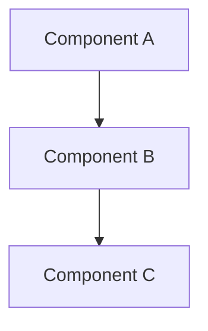

<!-- 
PURPOSE: This document details the technical architecture of the project, including
system components, interactions, and implementation details. It serves as the primary
technical reference for understanding how the system is built, including diagrams,
code examples, and directory structures.
-->

# Architectural Design

## System Overview
### High-Level Architecture
<!-- Include system diagram -->


## Component Design
### [Component Name]
#### Purpose
[Describe component purpose]

#### Technical Specifications
- Technology stack: [List technologies]
- APIs: [List APIs]
- Data models: [Describe models]

#### Code Examples
```javascript
// Example code showing key functionality
function example() {
    // Implementation
}
```

## Directory Structure
```bash
project/
├── src/
│   ├── components/
│   ├── services/
│   └── utils/
├── tests/
└── docs/
```

## Integration Points
### External Systems
- System name: [Description]
  - Integration method: [Description]
  - Data flow: [Description]